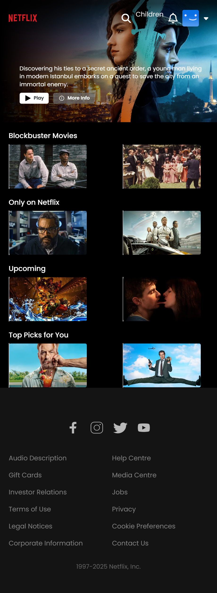

# Netflix Clone Project 🎬

A Netflix-like streaming platform clone built using **React** for the frontend, **Firebase** for authentication and database, and **TMDB API** for fetching real movie and TV show data.

---

## **Features**

- **User Authentication**: Sign up, login, and logout using **Firebase Authentication**.
- **Database Integration**: Store user data, watchlists, and preferences with **Firebase Realtime Database / Firestore**.
- **Dynamic Content**: Fetch real movies and TV shows using the **TMDB API**.
- **Responsive UI**: Fully responsive layout using **React, HTML, CSS, and JavaScript**.
- **Interactive Components**: Custom cards, banners, and navigation components.

---

## **Tech Stack**

- **Frontend**: React.js, HTML5, CSS3, JavaScript
- **Backend / Database**: Firebase (Authentication + Firestore/Realtime Database)
- **APIs**: TMDB API for movie and TV show data
- **Other Libraries**: Axios (for API calls), React Router (for routing), Bootstrap / Tailwind (optional)

---

----------------------------------------------------------------

# React + Vite

This template provides a minimal setup to get React working in Vite with HMR and some ESLint rules.

Currently, two official plugins are available:

- [@vitejs/plugin-react](https://github.com/vitejs/vite-plugin-react/blob/main/packages/plugin-react) uses [Babel](https://babeljs.io/) for Fast Refresh
- [@vitejs/plugin-react-swc](https://github.com/vitejs/vite-plugin-react/blob/main/packages/plugin-react-swc) uses [SWC](https://swc.rs/) for Fast Refresh

## Expanding the ESLint configuration

If you are developing a production application, we recommend using TypeScript with type-aware lint rules enabled. Check out the [TS template](https://github.com/vitejs/vite/tree/main/packages/create-vite/template-react-ts) for information on how to integrate TypeScript and [`typescript-eslint`](https://typescript-eslint.io) in your project.

Netflix-Clone-Website

Netflix-Clone-(For Mobile Size)

